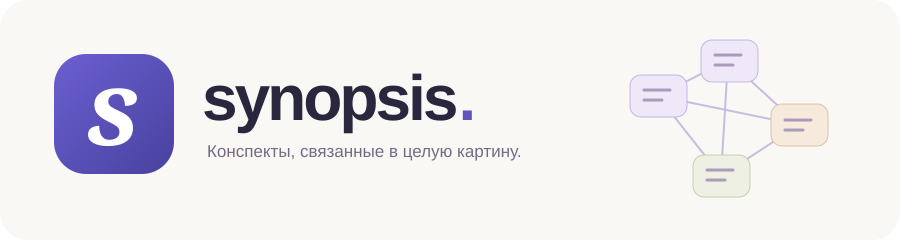
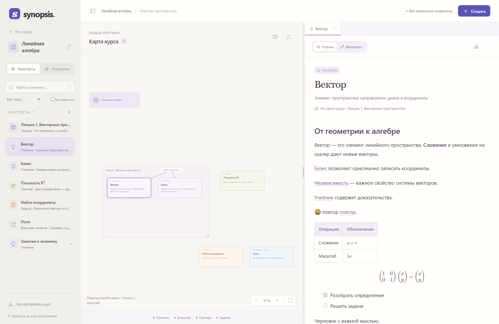

<p align="center">
  
</p>
<p align="center">
  
</p>

# Synopsis

**Локальное пространство для учёбы: конспекты, формулы и карта знаний в одном окне.**

Записывай материал в Markdown, объединяй его в лекции и связывай понятия на
карте. Открывай нужный конспект прямо из карточки, добавляй пояснения к тексту
и держи PDF-источники рядом. Каждый курс — отдельная библиотека, которую можно
целиком перенести одним файлом.

Без аккаунта и облачного сервиса. Приложение работает в браузере, а курсы и
вложения хранятся на твоём компьютере.

## Быстрый старт

### Windows — двойным щелчком

1. Если Python ещё не установлен, установи **[Python 3.11 или новее](https://www.python.org/downloads/)**. Это нужно сделать только один раз.
2. [Скачай проект ZIP-архивом](https://github.com/r-kulik/synopsis/archive/refs/heads/main.zip) и **распакуй его целиком** в обычную папку.
3. Дважды нажми **`Start Synopsis.cmd`**.

**Браузер откроется сам, когда приложение будет готово.** На главной нажми
«Новый курс», а внутри курса — «Создать», чтобы добавить первый конспект.

Не запускай файл прямо из окна ZIP-архива. Папка `frontend` должна оставаться
рядом со `start.py`: она содержит весь готовый интерфейс.

Оставь окно Synopsis открытым, пока работаешь. Для остановки сначала сохрани
конспект, затем нажми **Ctrl+C** в этом окне. Повторный запуск открывает уже
работающий экземпляр с тем же каталогом данных.

### Из терминала

В папке проекта выполни:

```shell
python start.py
```

На macOS/Linux команда обычно называется `python3 start.py`.
Браузер также откроется автоматически. Проверенная платформа — Windows с
Chrome/Edge; отдельная приёмка macOS/Linux пока не выполнена.

**Устанавливать npm, Docker, pip-пакеты или виртуальное окружение не нужно.**
Python-сервер использует стандартную библиотеку. CodeMirror, remark, KaTeX,
стили и шрифты уже включены в проект; при обычном запуске они не скачиваются.

## Что можно делать

- **Писать конспекты.** Markdown-редактор CodeMirror, таблицы, списки, изображения,
  inline-формулы и математические блоки LaTeX.
- **Собирать карту курса.** Лекции-рамки, понятия, внешние понятия, примеры и
  задачи. Карточки можно двигать, соединять линиями и настраивать их вид.
- **Связывать текст с идеями.** Из выделенного фрагмента — ссылка на конспект,
  новое понятие, факт-комментарий или ссылка на источник.
- **Работать с материалами.** Локальные изображения, PDF-источники и ссылки на
  страницу PDF. PDF открывается в отдельной вкладке браузера.
- **Сохранять контекст.** Вкладки, поиск, конспекты без карточек, резервные
  черновики и явное сравнение конфликтующих версий.
- **Переносить курсы.** Экспорт `.synopsis` включает тексты, карту, факты и
  вложения. Импорт создаёт отдельную копию и не перезаписывает оригинал.

<p align="center">
  
</p>

[Подробное руководство →](.docs/QA-USER-GUIDE.md)

## Где мои данные?

По умолчанию — в папке **`.synopsis-data` рядом со `start.py`**, независимо от
того, из какой папки запущена команда.

- `courses/` — сохранённые курсы;
- `assets/` — изображения и PDF.

Не удаляй эту папку при обновлении приложения. Для резервной копии экспортируй
курс через интерфейс либо скопируй всю `.synopsis-data` при остановленном сервере.
Несохранённые черновики в браузере не заменяют такую резервную копию.

Можно хранить данные отдельно от программы:

```shell
python start.py --data-dir "D:\Synopsis Courses"
```

## Пара полезных настроек

```shell
python start.py --port 8766
python start.py --no-browser
```

Первая команда меняет порт, вторая отключает автоматическое открытие браузера.
По умолчанию используется `127.0.0.1:8765`. Если порт занят другим приложением
или другой библиотекой Synopsis, запуск покажет понятную ошибку: чужой процесс
не останавливается, чужая библиотека не открывается. Не запускай два сервера
на разных портах с одним каталогом данных.

Если системный браузер не удалось открыть, адрес останется в окне запуска.
При отсутствующих файлах UI приложение сообщит об этом до старта.
Подробности работающего экземпляра: [диагностика сервера](http://127.0.0.1:8765/api/health).

## Из презентаций в курс — через Codex

Навык **`synopsis-from-slides`** и локальный MCP-сервер помогают собрать из
PPTX/PDF лекции, конспекты, понятия, примеры, задачи и связанную карту.
Агент отвечает за смысл, а сервер выдаёт ID и проверяет структуру перед
сохранением и экспортом `.synopsis`. Основная библиотека при этом не меняется.

[Подключение навыка и MCP →](.docs/MCP-AUTHORING.md)

Это дополнительная интеграция со своим Python-окружением; обычному запуску
Synopsis она не нужна.

## Для разработки

Нужна полная копия репозитория. Обычная работа приложения не требует этих шагов.

Если меняешь исходник рендера `tools/markdown-entry.js`, установи Node.js 22+
и пересобери локальный bundle:

```shell
npm ci
npm run build
```

HTML-страницы находятся в `frontend/*.html`, логика — в отдельных `.js`,
оформление — в `frontend/styles.css`. Их изменения не требуют npm-сборки.
После изменения Python перезапусти приложение.

Проверки:

```shell
python -m unittest discover -s tests
python -m unittest map.tests.test_map
npm run test:ui
npm run test:browser
npm run check:running -- --url http://localhost:8765
```

Браузерные тесты используют установленный Chrome и отдельные тестовые данные.
`check:running` проверяет уже работающий экземпляр без изменения курсов.

### Архив для передачи

```shell
python tools/build-release.py
```

Получится `dist/Synopsis-portable.zip`: приложение, готовый UI, руководство и
лицензии. В нём нет твоих курсов, `node_modules`, виртуального окружения и
тестовых данных. Получателю достаточно распаковать архив и запустить
`Start Synopsis.cmd` — **Python 3.11+ всё ещё необходим**. Это переносимая
Python-поставка, не самостоятельный `.exe`. Публикация архива в GitHub Releases
не выполняется автоматически.

## Статус и ограничения

Приложение рассчитано прежде всего на локальную работу на десктопе, не на
публичный сервер или совместное редактирование. Полная независимая приёмка
S08 и нагрузочные бюджеты больших курсов ещё не закрыты. Выделение для ссылок
ограничено безопасным текстовым фрагментом, а переход к странице PDF зависит
от просмотрщика браузера.

[Документация](.docs/README.md) · [Устройство UI](.docs/UI-FRONTEND.md) ·
[Проверки UI](.docs/reports/UI-recovery-report.md) ·
[Проверки запуска](.docs/reports/launcher-report.md) · [MIT License](LICENSE)
